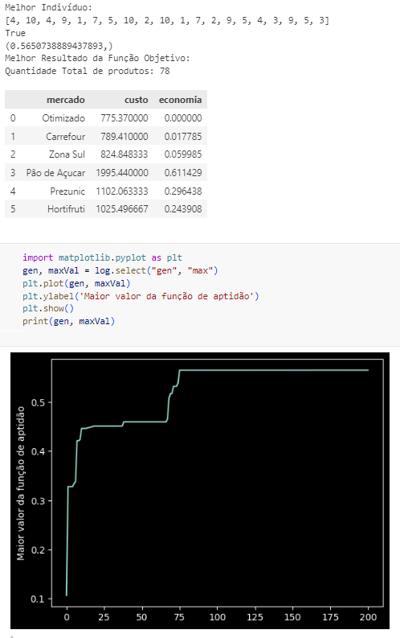

# Otimização_de_Compra_de_produtos_da_cesta_básica_em_mercados_online

#### Aluno: [Vinicius Faria](https://github.com/vinifariarj)
#### Orientador: [Felipe Borges](https://github.com/FelipeBorgesC)

---

Trabalho apresentado ao curso [BI MASTER](https://ica.puc-rio.ai/bi-master) como pré-requisito para conclusão de curso e obtenção de crédito na disciplina "Projetos de Sistemas Inteligentes de Apoio à Decisão".

---

### Resumo

Este trabalho traz uma proposta de otimzação de planejamento de compra de produtos que compõem a cesta básica nacional. A modelagem de otimização teve como insumos os dados de preços, coletados a partir de uma rotina de *web scraping*. Com os dados coletados, a idéia foi utilizar um otimizador através de um algoritmo genético, para se obter a melhor compra dos produtos que compoem o mínimo necessário para uma cesta básica.

### 1. Introdução

As compras de produtos da cesta básica são necessária para sobrevivência da população, onde são os produtos mínimos para uma família comprar no período de um mês. Estas compras consomem uma parte significativa dos gastos mensais da população. O objetivo deste trabalho é minimizar o custo da compra dos produtos selecionados para compor a cesta básica, coletando automaticamente informações de preços a partir de cinco sites de venda online e otimizando o planejamento de compra para uma quantidade pré-definida para um período, que neste caso é um mês, mas podendo ser alterado para mais de um mês, se assim desejar. 

Os mercados que disponibilizam os preços online, selecionados para realização do *web scraping*, foram: Carrefour, Zona Sul, Prezunic, Pão-de-Açucar e Hortifruti.

Não somente os preços foram levados em consideração, mas sim o valor do frete, com o mínimo de compra a se fazer.

Os detalhes de como foi realizada a modelagem do problema e quais os resultados obtidos, serão mostrados abaixo:

### 2. Modelagem

O problema foi divido em duas etapas: uma de coleta de preços e a outra de modelagem do otimizador.

O código fonte que faz o *web scraping* é o pesquisaCompras.py
O código do otimizador é o otimizador_cesta_basica.py

#### 2.1 Coleta de Preços

A coleta dos preços automatizada dos mercados é feita através de consultas desenvolvidas em código python utilizando técnicas de *web scraping*. Abaixo será descrito em detalhes o que cada código fonte faz.

* **[*Coleta de preço do mercado Carrefour*](scrapingCarrefour.py)** : Código fonte responsável por abrir um navegador Chrome com o link de busca de produtos do mercado Carrefour e recuperar os valores dos preços de um produto passado por parâmetro. O resultado da função que recupera os preços é uma biblioteca, onde a chave é o produto e o valor é o preço.

* **[*Coleta de preço do mercado Hostifruti*](scrapingHortifruti.py)** : Código fonte responsável por abrir um navegador Chrome com o link de busca de produtos do mercado Hortifruti e recuperar os valores dos preços de um produto passado por parâmetro. O resultado da função que recupera os preços é uma biblioteca, onde a chave é o produto e o valor é o preço.

* **[*Coleta de preço do mercado Pão-de Açucar*](scrapingPaodeAcucar.py)** : Código fonte responsável por abrir um navegador Chrome com o link de busca de produtos do mercado Pão-de-Açúcar e recuperar os valores dos preços de um produto passado por parâmetro. O resultado da função que recupera os preços é uma biblioteca, onde a chave é o produto e o valor é o preço.

* **[*Coleta de preço do mercado Prezunic*](scrapingPrezunic.py)** : Código fonte responsável por abrir um navegador Chrome com o link de busca de produtos do mercado Prezunic e recuperar os valores dos preços de um produto passado por parâmetro. O resultado da função que recupera os preços é uma biblioteca, onde a chave é o produto e o valor é o preço.

* **[*Coleta de preço do mercado Zona Sul*](scrapingZonaSul.py)** : Código fonte responsável por abrir um navegador Chrome com o link de busca de produtos do mercado Zona Sul e recuperar os valores dos preços de um produto passado por parâmetro. O resultado da função que recupera os preços é uma biblioteca, onde a chave é o produto e o valor é o preço.

* **[*Orquestrador de todas as coleta*](pesquisaCompras.py)** : Rotina que tem como entrada a lista de produtos da cesta básica que serão pesquisados em cada um dos mercados. As informações dos preços são coletadas e depois passa por um filtro para retirar produtos que não tem a ver com os da cesta básica, pois em cada site dos mercados o marketing destes fazem associações de vários produtos com o que foi pesquisado, trazendo no resultado muito lixo. Todos os preços dos produtos de todos os mercados serão armazenados em uma tabela em memória utilizando Data Frame, que será utilizado como entrada para o otimizador.

#### 2.2 Otimizador

O modelagem do otimizador foi desenvolvido em código python, que recebe como entrada a tabela Data Frame enriquecida na fase de coleta dos preços.

O otimizador está projetado da seguinte forma:
* **[*Gerador de indivíduos*]**: método customizado para gerar indivíduos, pois um indivíduo tem  suas premissas a serem seguidas. Um indivíduo é um vetor com o tamnaho de vinte, onde os indices pares são os identificadores do mercado e os indices ímpares são a quantidade do produto, respectivamente seguindo a ordem descrita abaixo.

Índices dos mercados: 
1 - Carrefour
2 - Hortifruti
3 - Pão de Açucar
4 - Prezunic
5 - Zona Sul

Índices dos grupos/produtos:
1 - "leguminosa":"arroz branco 1 kg"
2- "cereais":"feijão preto 1 kg" 
3 - "raizes":"batata"
4 - "legumes":"cebola"
5 - "frutas":"banana prata"
6 - "oleaginosas":"castanha caju"
7 - "carne":"ovos brancos"
8 - "leite":"leite pó integral 400 g"
9 - "oleos":"óleo soja 900 ml"
10 - "cafe":"café 500 g"

* **[*Avaliação*]**: A função de avaliação do otimizador é baseado no custo-benefício da cesta básica, onde é calculado dividindo a quantidade de produtos pelo valor total e ao final soma-se todos os resultados de cada mercado.

* **[*Penalidade*]**: Existe a penalidade para aqueles indivíduos que tiverem os valores inteiros dos identificadores dos mercados diferente do intervalo [1-5], valores inteiros da quantidade de produtos diferente de [1-10], custo total da cesta básica acima do total máximo estipulado no código, que neste caso está atribuído como R$ 800,00, e caso a solução otimizada não tenha tido economia, comparada se as compras fossem feitas em apenas um mercado.

* **[*Cruzamento*]**: Foi desenvolvido uma função customizada para prover o melhor cruzamento. Os métodos utilizados estão: cxTwoPoint, cxOnePoint e cxUniform. Caso o algorítmo não encontre um indíviduo que seja factível, então um indivíduo é gerado, pela função de geração de indivíduo por até cem vezes (limite de gereção do indivíduo).

* **[*Mutação*]**: Foi desenvolvido uma função customizada para prover a melhor mutação. Os métodos utilizados estão: mutShuffleIndexes (com indpb=0.5), mutUniformInt e mutShuffleIndexes (com indpb=0.7). Caso o algorítmo não encontre um indíviduo que seja factível, então um indivíduo é gerado, pela função de geração de indivíduo por até cem vezes (limite de gereção do indivíduo).

* **[*Seleção*]**: O método de seleção que melhor se adequou ao otimizador foi o de torneio.

* **[*População*]**: A população inicial foi de duzentos indivíduos, acrescentando algumas sementes customizadas incialmente para que o algorítmo tenha indivíduos que as compras foram feitas em apenas um mercado, não mesclando. Logo, inicialmente teremos duzentos e cinco indivíduos incialmente.

* **[*Algoritmo genético*]**: O algorítmo utilizado foi o eaSimple, para executar através de duzentas gerações.

### 3. Resultados

Para avaliação dos resultados obtidos, foi elaborada uma simulação da compra dos produtos da cesta básica em um só mercado, afim de comparação e avaliação do otimizador.

Os resultados encontrados permitiram uma economia que chegou ao máximo de 61% e o mínimo de 1,7% para um prazo de 1 meses otimizado em comparação à compra mensal somente em um dos mercados. 

### 4. Conclusões

Os resultados da otimização permitem uma economia ao realizar a compra dos produtos da cesta básica otimizada entre diferentes quantidades e sites dos mercados. Se aumentar o prazo, maior será a economia.

Considerando a volatilidade de preços da cesta básica, a abordagem do problema através de coleta automatizada de preços possibilita a atualização dos valores no dia em que se deseja realizar a otimização. Desta forma, a modelagem fica disponível para ser reaproveitada no futuro com a atualização dos preços de referência.

### 5. Próximos passos

A próxima etapa do projeto será criar um modelo que possa determinar se o IPCA dos produtos da cesta básica irão aumentar ou diminuir no próximo mês ou período, fazendo com que se tenha apoio a decisão de comprar mais produtos e estocar ou comprar somente o mínimo necessário. Dessa forma, a economia poderá ser maior observando as projeções do IPCA futuro.

---

Matrícula: 221.100.914

Pontifícia Universidade Católica do Rio de Janeiro

Curso de Pós Graduação *Business Intelligence Master*

